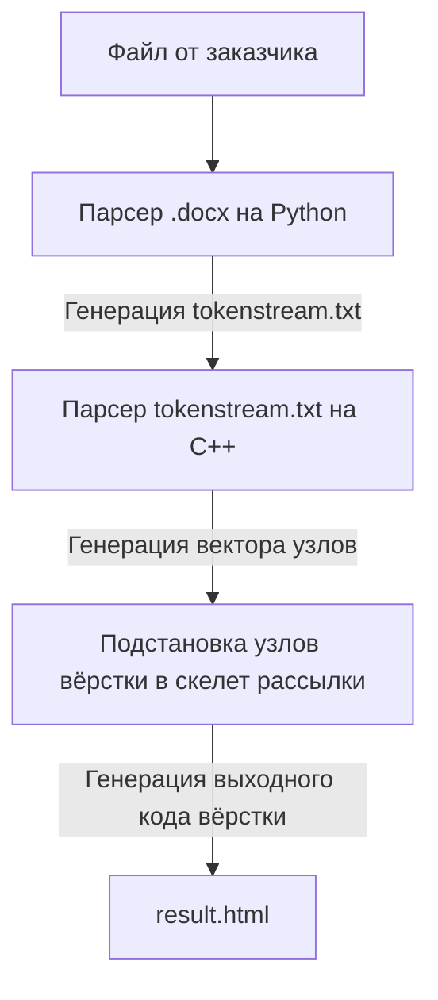

## Компилятор рассылок EAC (Email ActiveCampaign)

Данная утилита предназначена для генерации email-рассылок, представляющих собой вёрстку, использующих HTML 4.01 Transitional. 

Email-рассылка представляет собой заготовленный шаблон табличной вёрстки, который отличается только по информации о регионе, на который идёт эта рассылка и вектором узлов вёрстки (абзац, кнопка, маркированный список и т.д...).

Задача компилятора рассылок - автоматизировать процесс сбора имейлов и взять на себя рутинные подстановки благодаря формальному заданию узлов вёрстки писем.

## Frontend компилятора рассылок EAC

Задача фронтенда (части со стороны клиента) компилятора - принимать на вход файл формата `.docx` от заказчика и разбирать его в текстовый файл `tokenstream.txt`, к которому имеет доступ компилятор. При отсутствии этого файла, он создаётся. При отсутствии входного .docx-файла выбрасывается исключение `"Failed to find input argv[2].docx file"`.
<br><br>
Frontend-часть использует библиотеку **python-docx** и написана на Python. Именно это позволяет разобрать документ, отделить ссылки, стилизацию, жирность, курсив текста и т.д... Далее файл `tokenstream.txt` подаётся на вход бэкенд части компилятора.

## Backend компилятора рассылок EAC

Задача бэкенда (части, которая не касается клиентской стороны) заключается в том, чтобы корректно парсить входной файл `tokenstream.txt`, создавая узлы вёрстки. Бэкенд знает о том, как должен быть устроен "скелет" рассылки, внутрь этого скелета он выполняет подстановку того, что ему удалось разобрать из текстового файла `tokenstream.txt`. Бэкенд генерирует выходной файл `result.html`, содержащий код вёрстки HTML 4.01 Transitional, который и представляет собой рассылку.

## Конечный результат компилятора 

После того, как компилятор сгенерировал текстовый файл `result.html`, его полномочия в данной точке заканчиваются, и он завершает свою работу. Исполнитель технического задания забирает себе содержимое сгенерированного компилятором файла и использует его в своих целях: как правило, это подстановка во встроенный текстовый редактор **ActiveCampaign**. 
<br>
> ⚠️ <u>**Важно подметить:**</u> _компилятор EAC не является панацеей, и он умеет обрабатывать **только** конкретные узлы вёрстки, которые прошиты в него. Если рассылка по ТЗ будет предполагать узлы вёрстки, которые не описаны в `EAC_SPECIFICATION.md`, то исполнитель вручную прописывает вёрстку, которая неизвестна компилятору. Также, баннер добавляется в код вёрстки **исполнителем вручную**_.

## Запуск компилятора рассылок EAC

Запуск компилятора производится с передачей трёх параметров:
```
../EAC_Compiler.exe dach ../DACH_webinar_30_05_invite.docx 10c2c2
                    ^    ^                                 ^
    параметры:      1    2                                 3         
```
<u>Первый параметр</u> отвечает за **языковой регион**, на который отправляется данная рассылка. Он необходим для того, чтобы компилятор выполнил подстановку ссылок на соц-сети iSpring для **заданного языкового региона**. Например, здесь DACH - немецкий языковой регион, соответственно компилятор выполнит подстановку ссылкок с доменом `.de` там, где это ожидается: логотип вверху рассылки, ссылки в футере на соцсети и контакты, а также подставит текст на заданном языке. С полным списком параметров региона, которые понимает компилятор, можно ознакомитсья в `EAC_SPECIFICATION.md`. При передаче неверного параметра региона выбрасывается исключение `"Unknown region"`
<br><br>
<u>Второй параметр</u> представляет собой полный путь до входного .docx-файла. Входной .docx-файл **<u>не должен содержать ничего</u>, кроме тела рассылки, даже Subject**. Если входной файл не найден по указанному пути, будет выброшено исключение `"Failed to find input argv[2].docx file"`.
<br><br>
<u>Третий параметр</u> отвечает за хранение тематического цвета кнопок, ссылок рассылки. Например, для рассылок по <span style="color: #10c2c2; font-weight: 700;">iSpring LMS</span> свой тематический цвет, а для рассылок по <span style="color: #e44083; font-weight: 700;">iSpring Suite</span> - свой. При необходимости править цвета в определенных местах, это делается вручную. Цвет передаётся **без** первоначального символа `#`!

## Фазы компиляции


